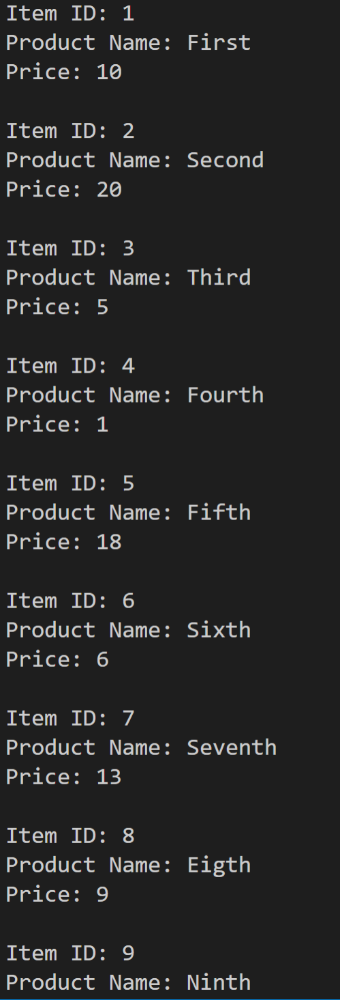
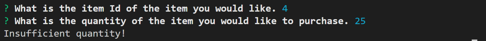
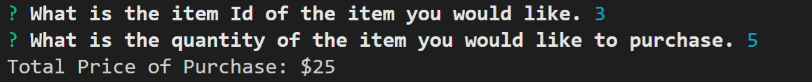
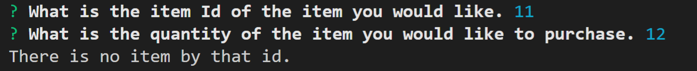

# Bamazon-App

Problem: The problem the app is that the user needs an easy way of viewing items for sale and purchasing said items.

Overview: The app is organized with most of the actual functionality contained in functions. It uses SQL to pull info from a database that will show the info for each product and then allow the user to select an item to purchase and if there is enough of the said item it will then update the database to the new quantity.

Instructions: start by doing "npm install", then "node bamazonCustomer.js" it will show the user the information for each product and then ask the user for a item ID and then it will ask for a quantity of the item to purchase. If there is enough of the item in the database then it will remove the specified quantity from the stock, if there is not enough then it will not allow the order to go through.

Images: 

Git Link: https://github.com/JamesConry/Bamazon-App

Notable Technologies used: mySQL

Role: Complete creation of app.
